# System Architecture Document (SAD)

| Metadata | Specification |
| :--- | :--- |
| **System** | VibeVeil Core Daemon & CLI |
| **Document ID** | SAD-VV-002 |
| **Version** | 1.0.0 |
| **Status** | Approved & Implemented |
| **Architecture Pattern** | Hexagonal (Ports & Adapters) / Clean Domain Architecture |
| **Language & Toolchain** | Safe Async Rust (Rust 2024 / rustc 1.98+) |
| **Primary Authors** | Jose Eduardo Rojas Jimenez |

---

## 1. Architectural Philosophy

VibeVeil is architected around the **Hexagonal (Ports and Adapters)** paradigm. Core domain logic—such as perceptual color matching, rulebook evaluations, and media indexing—is isolated from external infrastructural drivers (the Linux D-Bus bus, the filesystem, external image codecs, network sockets, and display compositor IPC protocols).

```
                      ┌────────────────────────────────────────┐
                      │            Driving Ports               │
                      │  - D-Bus MPRIS Event Stream (zbus)     │
                      │  - CLI Invocations (clap)              │
                      │  - Systemd Signals                     │
                      └──────────────────┬─────────────────────┘
                                         │
                                         ▼
┌──────────────────────────────────────────────────────────────────────────────┐
│                             VibeVeil Domain Core                             │
│                                                                              │
│   ┌─────────────────────┐    ┌──────────────────┐    ┌───────────────────┐   │
│   │    TrackContext     │───▶│   MatchStrategy  │───▶│    MatchResult    │   │
│   │ (Title/Artist/Art)  │    │  (Pipeline/Oklab)│    │ (Asset/Confidence)│   │
│   └─────────────────────┘    └──────────────────┘    └───────────────────┘   │
│              ▲                         ▲                                     │
│              │                         │                                     │
│   ┌─────────────────────┐    ┌──────────────────┐                            │
│   │   Color Analyzer    │    │    MediaPool     │                            │
│   │ (Oklab ΔE Clusters) │    │  (Asset Vectors) │                            │
│   └─────────────────────┘    └──────────────────┘                            │
└────────────────────────────────────────┬─────────────────────────────────────┘
                                         │
                      ┌──────────────────┴─────────────────────┐
                      │            Driven Ports                │
                      │  - Compositor Backend (Hyprland IPC)   │
                      │  - Theme Synthesizer (Noctalia M3)     │
                      │  - Video Surface Manager (mpvpaper)    │
                      │  - Local Cache Repository (XDG Cache)  │
                      └────────────────────────────────────────┘
```

---

## 2. Core Subsystems

### 2.1. Ingestion Subsystem (`vibeveil::mpris`)
* **Role:** Subscribes to the active Linux user session bus (`DBus`) and monitors media player state changes.
* **Mechanism:** Leverages `zbus` to establish a zero-allocation async connection. Rather than polling, it listens to the standard `org.mpris.MediaPlayer2.Player` interface for `PropertiesChanged` signals.
* **Normalization:** Translates raw D-Bus `OwnedValue` dictionaries into a strongly-typed `MprisTrack` domain entity, normalizing artists, track titles, album names, and artwork URIs.

### 2.2. Asset Cataloging & Pool Subsystem (`vibeveil::pool`)
* **Role:** Recursively indexes and manages the target media collection.
* **Decoupling:** Ignores naming conventions or folder hierarchies; treats any folder tree as a set of `MediaItem` records.
* **Tag Synthesis:** Automatically derives semantic tags from directory paths, filenames, and embedded metadata.
* **Color Fingerprinting:** For static images and video poster stills, downsamples images to a 64x64 thumbnail matrix prior to computing dominant color clusters, eliminating memory pressure and CPU bottlenecks. Serializes the index to `~/.cache/vibeveil/pool_index.json` for $O(1)$ startup lookups.

### 2.3. Perceptual Color Science Subsystem (`vibeveil::color`)
* **Role:** Mathematically quantifies color perception and harmony.
* **Color Spaces:** Converts standard sRGB coordinates into the **Oklab** perceptual color space.
* **Metric:** Evaluates the Euclidean distance $\Delta E_{\text{ok}}$:
  $$\Delta E_{\text{ok}} = \sqrt{(L_1 - L_2)^2 + (a_1 - a_2)^2 + (b_1 - b_2)^2} \times 100$$
* **Multi-Cluster Weighting:** Calculates composite distance across primary, secondary, and accent colors to determine visual compatibility.

### 2.4. Semantic Match Engine Subsystem (`vibeveil::matcher`)
* **Role:** Decoupled strategy pipeline that maps a `TrackContext` to a `MatchResult`.
* **Trait Abstraction:**
  ```rust
  pub trait MatchStrategy: Send + Sync {
      fn name(&self) -> &'static str;
      fn find_match(&self, track: &TrackContext, pool: &MediaPool) -> Option<MatchResult>;
  }
  ```
* **Strategies:**
  1. `RulebookMatcher`: User-defined regex expressions mapping track titles, artists, or genres directly to specific media tags.
  2. `ColorDistanceMatcher`: Searches the `MediaPool` for the asset minimizing $\Delta E_{\text{ok}}$ against the song's album art.
  3. `ProceduralCanvasMatcher`: Fallback synthesizer that generates a blurred glassmorphic canvas from the album art.
  4. `HybridMatcher`: Cascading pipeline: Rulebook $\to$ Color Distance $\to$ Procedural Canvas.

### 2.5. Compositor Dispatch Subsystem (`vibeveil::compositor`)
* **Role:** Projects the chosen visual state onto the Wayland desktop surfaces.
* **Hyprland / Noctalia Backend:**
  * **Live Video:** Updates atomic symlink `~/.config/hypr/current_wallpaper.mp4` and triggers `systemctl --user restart hypr-livewallpaper.service`.
  * **Theme Pipeline:** Passes the asset thumbnail to `noctalia msg wallpaper-set "$POSTER"`, which extracts Material You 3 colors and renders `~/.config/hypr/noctalia.lua`.
  * **Border Reload:** Triggers `hyprctl reload` to repaint active window borders without restarting the compositor.

---

## 3. End-to-End Sequence Diagram

```mermaid
sequenceDiagram
    autonumber
    actor User
    participant Spotify as Spotify (MPRIS)
    participant Daemon as VibeVeil Daemon
    participant CDN as Spotify CDN
    participant Matcher as HybridMatcher
    participant Pool as MediaPool
    participant Noctalia as Noctalia Shell
    participant Hyprland as Hyprland Compositor

    User->>Spotify: Plays Next Track ("Midnight Express")
    Spotify->>Daemon: D-Bus Signal (PropertiesChanged: Title, Artist, artUrl)
    
    rect rgb(24, 28, 36)
        Note over Daemon,CDN: Asset Fetch & Color Analysis
        Daemon->>CDN: GET /image/ab67616d... (If not cached)
        CDN-->>Daemon: Album Art Binary (JPEG/PNG)
        Daemon->>Daemon: Extract Dominant Palette (Oklab Vectors)
    end

    rect rgb(30, 36, 48)
        Note over Daemon,Pool: Decoupled Semantic Matching
        Daemon->>Matcher: find_match(TrackContext, MediaPool)
        Matcher->>Matcher: Check Rulebook Regex ("night" -> "cyberpunk_lucy")
        Matcher->>Pool: Query tag "cyberpunk_lucy"
        Pool-->>Matcher: MediaItem (cyberpunk_lucy.mp4)
        Matcher-->>Daemon: MatchResult (Asset Path, Strategy, Confidence)
    end

    rect rgb(36, 44, 58)
        Note over Daemon,Hyprland: Surface & Theme Dispatch
        Daemon->>Daemon: Update Symlink (current_wallpaper.mp4)
        Daemon->>Noctalia: noctalia msg wallpaper-set <poster.png>
        Noctalia->>Noctalia: Extract M3 Palette & Render noctalia.lua
        Noctalia->>Hyprland: hyprctl reload (User Template Hook)
        Hyprland-->>User: Window Borders & Top Bar Repainted in Neon Cyan
    end
```



---

## 4. Concurrency & Asynchronous Execution Model

* **Runtime:** Powered by `tokio` multi-threaded async runtime.
* **D-Bus Channel:** Uses non-blocking socket I/O; sleeps on epoll wait until Linux kernel notifies of D-Bus session activity.
* **Event Debouncing & Task Preemption:** Implements a 250ms trailing debounce timer on incoming track change events. When rapid track skips occur, any in-flight download, color extraction, or theme dispatch task is preempted immediately using `tokio::task::AbortHandle` / `CancellationToken`, eliminating IPC thrashing and display flickering.
* **CPU Consumption:** Drops to 0.00% between song transitions.
* **Disk I/O & Detached Pruning:** Album art and pool indices are memory-cached with SHA256 content addressing, avoiding repeated downloads and redundant file reads. An LRU eviction cap guarantees disk storage bounds (`max_cache_mb`); pruning runs in a detached background Tokio task (`tokio::spawn`), preventing disk stat/unlink I/O jitter from encroaching on the $<50\text{ms}$ dispatch path.

---

## 5. Filesystem & Runtime State Layout

```
~/.config/
├── vibeveil/
│   └── config.toml                  # Primary user configuration & rulebook
└── hypr/
    ├── current_wallpaper.mp4        # Atomic symlink to active video
    └── noctalia.lua                 # Evaluated Lua palette for Hyprland borders

~/.cache/
└── vibeveil/
    ├── pool_index.json              # Cached media metadata & color vectors
    ├── album_art/                   # Downloaded album covers (<sha256>.png)
    └── thumbnails/                  # Auto-generated video reference frames
```
